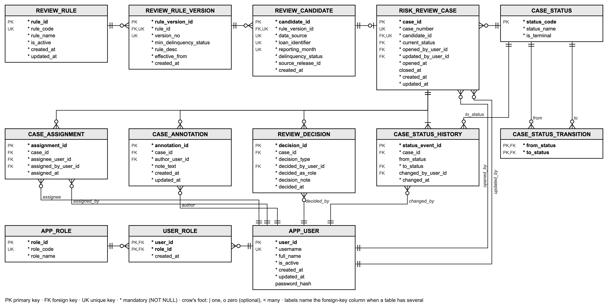

# Loan-Review System (OLTP) Design

A completed conceptual, logical, and relational design for a loan-review system: 13 tables in third normal form (3NF). The design selects review candidates from warehouse data and records their review in separate OLTP tables.

Current stage: the three models and the 13-table ER diagram are complete. Table DDL, constraints, indexes, triggers, stored procedures, and the Spring Boot application will be implemented in later milestones; this repository does not yet contain runnable OLTP files.

## 1. Where the business process comes from

This workflow is a simplified demonstration designed for this project; it is not a bank operating procedure. Its design uses two patterns:

- **Case management:** Salesforce's official object reference includes [Case](https://developer.salesforce.com/docs/atlas.en-us.api.meta/api/sforce_api_objects_case.htm), CaseComment, CaseHistory, and CaseStatus. They provide a reference pattern for this design's case, annotation, status-history, and status tables; the schema and workflow here are independently designed.
- **Four-eyes / maker-checker:** one person prepares a transaction and another independently approves it, a common authorization pattern in financial systems, including credit approval ([maker-checker](https://en.wikipedia.org/wiki/Maker-checker), [four-eyes principle](https://openriskmanual.org/wiki/Four_Eyes_Principle)). Here an Analyst records the review and a Manager makes the decision. This is a simplified project role split, not a claim about a particular institution's policy.

Salesforce also documents [CaseHistory](https://developer.salesforce.com/docs/atlas.en-us.264.0.object_reference.meta/object_reference/sforce_api_objects_casehistory2.htm). These references inform the case-management pattern; they are not a specification for this application's behavior. Specific regulatory and servicer rules would need to be checked against their original texts before being added.

The candidate rule in the design compares successive monthly delinquency statuses and selects loans that newly reach 60 or more days delinquent. The monthly file provides the status field; the threshold is a project design choice. Candidate selection is not implemented in this repository.

## 2. Business process

```
Design: select loans that newly reach 60+ days delinquent (review_candidate)
  → a review case is opened for a candidate (risk_review_case, status OPEN)
  → a Manager assigns the case to an Analyst (case_assignment, status ASSIGNED)
  → the Analyst adds notes and the basis for a judgment (case_annotation, status IN_REVIEW)
  → the Manager decides: close (CLOSED), or escalate (ESCALATED → closed later)
  → after closure, a Manager may reopen a case for further review (CLOSED → IN_REVIEW)
Design: record every status change in case_status_history
```

The design has two roles: the **Analyst** reviews cases and writes notes; the **Manager** assigns cases and makes decisions.

## 3. Entity-relationship model



The diagram shows the 13 designed tables and their columns. PK = primary key, FK = foreign key, UK = unique key, `*` = mandatory (NOT NULL). Crow's-foot notation: `|` one, `o` zero (optional), `<` many. Where a table has several foreign keys to the same table, the line is labeled with the column (for example `assignee` and `assigned_by`).

## 4. Logical and relational model (13 tables)

| Table | Primary key | Business unique key | Description |
|---|---|---|---|
| `app_user` | user_id | username | Application user |
| `app_role` | role_id | role_code | Reference: ANALYST, MANAGER |
| `user_role` | (user_id, role_id) | — | Users and roles are many-to-many |
| `review_rule` | rule_id | rule_code | Review rule |
| `review_rule_version` | rule_version_id | (rule_id, version_no) | Rule parameters; changing a rule adds a new version instead of overwriting |
| `review_candidate` | candidate_id | (rule_version_id, data_source, loan_identifier, reporting_month) | Candidate selected from the warehouse, with its data source and release |
| `case_status` | status_code | — | Reference: OPEN, ASSIGNED, IN_REVIEW, ESCALATED, CLOSED |
| `case_status_transition` | (from_status, to_status) | — | Allowed status changes |
| `risk_review_case` | case_id | case_number; candidate_id | Review case; at most one per candidate |
| `case_assignment` | assignment_id | — | Assignment records, append-only |
| `case_annotation` | annotation_id | — | Notes |
| `case_status_history` | status_event_id | — | Status history, append-only |
| `review_decision` | decision_id | — | Manager decisions, append-only |

## 5. Design rationale

- **Third normal form (3NF):** the design separates roles, status labels, and rule parameters from cases so each fact has one home instead of being repeated across case rows.
- **Audit history:** separate assignment, note, decision, and status-history tables preserve the sequence and authors of review actions. The later implementation must enforce the intended append-only behavior so earlier decisions remain inspectable.
- **Versioned rules:** thresholds have versions and each candidate records the version that selected it, so changing a rule does not change the basis for earlier candidates.
- **Status transitions:** a table lists permitted changes, including a Manager reopening a closed case (`CLOSED` → `IN_REVIEW`). A later trigger must enforce the table so a case cannot jump from `OPEN` to `CLOSED` without review.
- **Stable loan reference:** a candidate records data source, loan identifier, and source release instead of a warehouse-generated surrogate key, because that key can be regenerated when the warehouse is reloaded. The earlier candidate remains linked to the source version reviewed when a later release corrects the loan.

## 6. Limitations

- It is a demonstration of a review process, not any bank's actual procedure.
- It covers review and decision only: borrower contact and workout evaluation are out of scope.
- Users and roles are demo data; there is no workload balancing or deadline (SLA) tracking.

## 7. Next steps

- Recreate the completed Enterprise, Logical, and Relational designs in Oracle SQL Developer Data Modeler and generate DDL from those models.
- Implement and test each table, constraint, index, trigger, and stored procedure in later milestones; reconcile the diagram with the implemented schema when those files are published.
